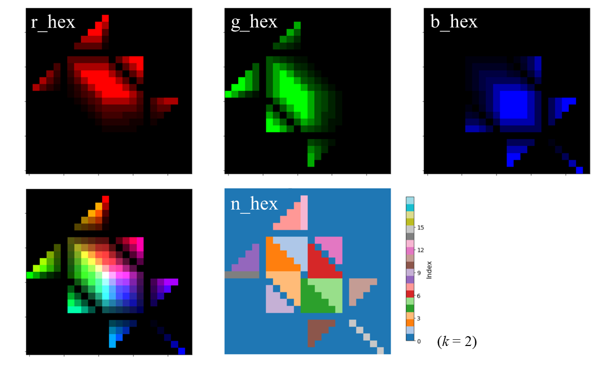

# RGB Hexagram (Kondo 2025)
## Introduction
This software provides sample source code as a tutorial for applying the RGB (Red, Green, and Blue) hexagram, a visualization and multivariate analysis method, to 3D and higher-dimensional data.
The supported languages are now Python and fortran.  If you are a fortran user and you want to use fortran codes, please contact me with the e-mail address in [ORCID](https://orcid.org/0000-0003-4434-7877).

Please see [Kondo (2025)](https://doi.org/10.2151/sola.2025-028) for details of the visualization and multivariate analysis method.


**RGB Hexagram a sample figure with a analysis grid version.**

***

### Licence and agreement
The source codes are distributed under the [MIT license](https://opensource.org/licenses/MIT).  
You must cite [Kondo (2025)](https://doi.org/10.2151/sola.2025-028) in an appropriate way when you present and/or publish scientific results and products using this visualization and multivariate analysis method.

M. Kondo, 2025: RGB Hexagram Approach for Visualization and Multivariate Analysis with Application to Mixed-Phase Clouds, Scientific Online Letters on the Atmosphere, doi:10.2151/sola.2025-028, accepted.

***

### Overview of this repository
This repository provides a step-by-step tutorial for generating and visualizing the RGB Hexagram, a new visualization method for multivariate analysis. The RGB Hexagram maps three normalized variables to the Red, Green, and Blue (RGB) color channels on a structured hexagram grid, enabling intuitive interpretation of multivariate data distributions including atmospheric science applications such as cloud microphysical analysis. 

#### Key Features

* RGB Hexagram Grid Generation: The Python program ( `generate_rgb_hex.py` ) generate structured hexagram color maps based on cyclic RGB assignment rules.
* Multivariate Mapping: Users can assign their own normalized variables (e.g., liquid water content, ice water content, vertical velocity) to RGB channels for visual analysis.
* Python Visualization: Python scripts read the any output and generate color-mapped images with consistent x–y orientation and grid labeling.

<br>

# RGB Hexagram Tutorial
## What is this tutorial?

This tutorial demonstrates how to generate, visualize, and apply the **RGB Hexagram**—a new visialization and multivariate analysis method developed by Makoto Kondo (2025). The RGB Hexagram method maps **three variables** onto the Red, Green, and Blue color channels and arranges them in a **structured hexagonal grid**, allowing intuitive visualization and analysis of mixtures (1-, 2-, and 3-components combinations).

This tutorial is designed for:
- Researchers analyzing multivariate scientific data

This tutorial uses **Python (for visualization and application with sample data)**.


## File Structure
```
RGB_Hexagram_Tutorial/
├── LICENSE
├── README.md
└── for_python
    ├── generate_rgb_hex.py                        # Generate RGB values for R, G, and B components of RGB Hexagram and each Area number of RGB Hexagram. generate_rgb_hex.py is used as import generate_rgb_hex.py
    ├── RGB_hexagram_tutorial_for_generation.ipynb # Tutorial for applying RGB Hexagrams to 3D data (3 components of RGB)
    ├── RGB_hexagram_tutorial_for_4dim_data.ipynb  # Tutorial applying RGB Hexagrams to 4D data (3 RGB components + vertical axis)
    └── RGB_hexagram_tutorial_for_5dim_data.ipynb  # Tutorial applying RGB Hexagrams to 5-dimensional data (3 RGB components + vertical axis + time axis)
```
    

---

# Tutorial Workflow


### Step 1: Generate RGB Hexagram Arrays

You can use the **Python module** to generate the RGB Hexagram arrays in this tutorial. If you are a fortran user and you want to use fortran codes, please contact me with the e-mail address in [ORCID](https://orcid.org/0000-0003-4434-7877).

#### For python users
```
cd for_python
python
>>> from generate_rgb_hex import generate_rgb_hex
>>> r_hex, g_hex, b_hex, num_hex = generate_rgb_hex(k=11)
```

* The coefficient *k* here defines the size of the RGB hexagram. A coefficient *k* value of 11 or less is recommended.
* r_hex, g_hex, b_hex, and num_hex are numpy arrays of RGB values for R, G, and B components of RGB hexagram and each Area number of RGB hexagram

The 2D arrays: R, G, B, and Area index are saved as `r_file: rw_hex_test_d.csv , g_file: gw_hex_test_d.csv , b_file: bw_hex_test_d.csv n_file nw_hex_test_d.csv` .

<br>

***

### Step 2: Visualize RGB Hexagram Structure

In the Jupyter Notebook `RGB_hexagram_tutorial_for_generation.ipynb` , the following visualizations are included:



**RGB value distribution (r_hex, g_hex, b_hex), Composite RGB image based on the RGB Hexagram structure, Area index map (num_hex)**


You can visualize:

* Red/Green/Blue channel data separately
* Combined RGB colormap image
* Area indices for analysis

<br>

***

### Step 3: Apply RGB Hexagram to 3D Data

The notebook also includes a section where random sample data (e.g., 3 subject scores) is:

1. Normalized
2. Mapped to RGB channels
3. Positioned on the RGB Hexagram
4. Visualized as frequency distributions
5. Percentage calculations for each Area


* In `RGB_hexagram_tutorial_for_4dim_data.ipynb` , you can plot a histogram with a vertical axis for each Area.
* In `RGB_hexagram_tutorial_for_5dim_data.ipynb` , you can plot a vertical-time figures for each Area.
  

#### Example use cases:
* Mapping scientific variables to visualize dominant mixing states
* Tracking temporal evolution using additional vertical or time dimensions

***

## Reference
**[M. Kondo, (2025)](https://doi.org/10.2151/sola.2025-028): RGB Hexagram Approach for Visualization and Multivariate Analysis with Application to Mixed-Phase Clouds. *Scientific Online Letters on the Atmosphere (SOLA)*, accepted.**

***

#### Contact
If you have any questions, please contact me via the email address in [ORCID](https://orcid.org/0000-0003-4434-7877).
