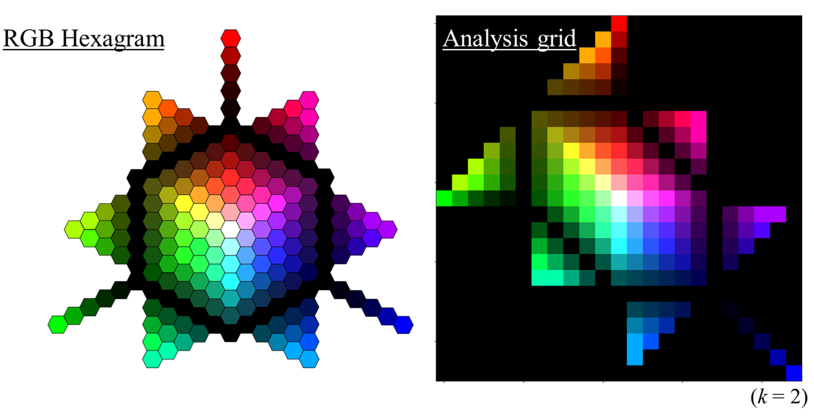
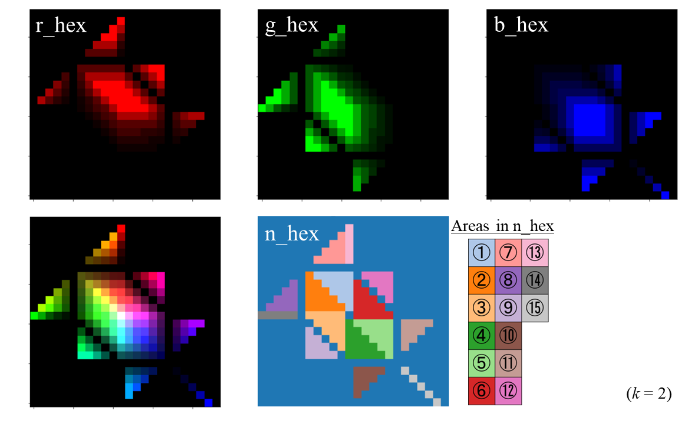
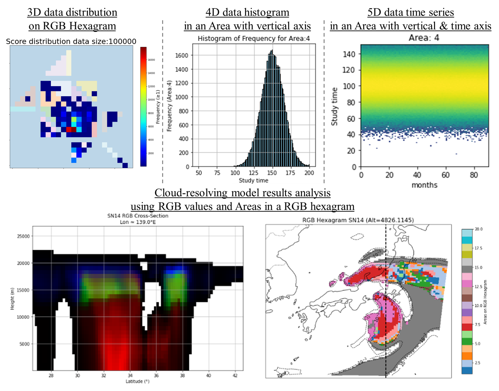

# RGBヘキサグラム (Kondo 2025)
## はじめに
このソフトウェアは、Kondo (2025)で開発されたRGB(Red, Green, Blue)ヘキサグラムという可視化・多変量解析手法を、3次元データや高次元データに適用するためのチュートリアルとして、サンプルソースコードを提供しています。
対応言語はPythonとfortranです。 fortranをお使いの方で、fortranのコードを使いたい方は、[ORCID](https://orcid.org/0000-0003-4434-7877)のメールアドレスまでご連絡ください。

RGBヘキサグラムの可視化と多変量解析の方法の詳細は[Kondo (2025)](https://doi.org/10.2151/sola.2025-028)を参照してください。



**RGBヘキサグラムのサンプル図と解析格子で描画されたRGBヘキサグラム**

***

### ライセンス
このソースコードは[MITライセンス](https://opensource.org/licenses/MIT)の下で配布されています。
このRGBヘキサグラムでの可視化・多変量解析手法を用いた科学的な成果物を発表・公表する際には、適切な方法で[Kondo (2025)](https://doi.org/10.2151/sola.2025-028)を引用する必要があります。

M. Kondo, 2025: RGB Hexagram Approach for Visualization and Multivariate Analysis with Application to Mixed-Phase Clouds, Scientific Online Letters on the Atmosphere, doi:10.2151/sola.2025-028, accepted.

***

### このリポジトリの概要
このリポジトリでは、多変量解析のための新しい可視化手法であるRGBヘキサグラムの生成と可視化のための段階的なチュートリアルを提供します。RGB ヘキサグラムは、構造化されたヘキサグラムグリッド上の赤、緑、青（RGB）カラーチャンネルに3つの正規化された変数を対応付け、任意の多変量データ(e.g., 雲微物理量やレーダーパラメータなど)の構造の直感的な解釈を可能にします。


#### 主な機能

* RGBヘキサグラムグリッド生成： Pythonプログラム( `generate_rgb_hex.py` )は、周期的なRGB割り当て規則に基づいて、構造化されたヘキサグラムカラーマップを生成します。
* 多変量マッピング：ユーザは、独自の正規化された変数（例えば、液体含水率、氷水含水率、垂直速度）を視覚的分析のためにRGB値それぞれに割り当てることができます。
* Pythonによる視覚化： Pythonスクリプトは、任意の出力を読み取り、一貫したx-y方向とグリッドラベリングで可視化された画像を生成します。

<br>

# RGBヘキサグラムのチュートリアル
## このチュートリアルで行うこと

このチュートリアルでは、Kondo (2025)によって開発された新しい可視化と多変量解析手法である**RGBヘキサグラム**の生成、可視化、適用方法を示します。RGBヘキサグラムでは、**3つの任意の変数** をRed、Green、BlueのRGB値にマッピングし、それらを**構造化されたヘキサグラム上** に配置することで、混合（1成分、2成分、3成分の組み合わせ）の直感的な可視化と分析を可能にします。

このチュートリアルは次のような方々を対象としています
- 多変量科学データを分析する研究者

このチュートリアルでは、**Python** を使用します(サンプルデータによる可視化と多変量解析のため)。

## ファイル構造
```
RGB_Hexagram_Tutorial/
├── LICENSE
├── README.md
└── for_python
│   ├── generate_rgb_hex.py                        # RGBヘキサグラムのR,G,B成分およびRGBヘキサグラムの各AreaのRGB値を生成する。generate_rgb_hex.pyはimport generate_rgb_hex.pyとして使用します。
│   ├── RGB_hexagram_tutorial_for_generation.ipynb # RGBヘキサグラムを3次元データに適用するためのチュートリアル（RGBの3成分）
│   ├── RGB_hexagram_tutorial_for_4dim_data.ipynb  # RGBヘキサグラムを4次元データに適用するためのチュートリアル（RGBの3成分+鉛直軸）
│   └── RGB_hexagram_tutorial_for_5dim_data.ipynb  # RGBヘキサグラムを5次元データに適用するためのチュートリアル（RGBの3成分+鉛直軸+時間軸）
└── RGB_hexagram_CRM (another repository)
    ├── LICENSE
    ├── README.md
    ├── README_jp.md
    ├── RGB_hexagram_tutorial_for_SCALE_comparison.ipynb # RGBヘキサグラムを気象モデル結果に適用するためのチュートリアル (RGBの3成分+鉛直軸+時間軸)
    ├── images_crm
    │   └── RGB_hexagram_Area_analysis_CRM.png
    └── sample_simulation_data
        ├── merged-z_history_d01_t08.pe000000.nc
        └── merged-z_history_d01_sn14.pe000000.nc


```

---

# チュートリアルの流れ


### Step 1: RGBヘキサグラム配列の生成

このチュートリアルのRGBヘキサグラム配列を生成するには、**Python**を使用することができます。もしあなたがfortranユーザーで、fortranコードを使いたい場合は、[ORCID](https://orcid.org/0000-0003-4434-7877)にあるメールアドレスまでご連絡ください。

#### Pythonユーザー
```
cd for_python
python
>>> from generate_rgb_hex import generate_rgb_hex
>>> r_hex, g_hex, b_hex, num_hex = generate_rgb_hex(k=11)
```

* ここで係数*k*はRGBヘキサグラムの大きさを定義します。係数 *k* の値は11以下を推奨します。
* r_hex、g_hex、b_hex、num_hexは、RGBヘキサグラムのR、G、B成分、およびRGBヘキサグラムの各 Area番号のRGB値のnumpy配列です。

###### 係数*k*とRGBヘキサグラム平面のサイズ*N*×*N*は*N*=8*k*+7という関係があります。各配列は扱いやすさのため(*N*+1)×(*N*+1)のshapeとなっています。

R, G, B, Areaの2次元配列は `r_file: rw_hex_test_d.csv , g_file: gw_hex_test_d.csv , b_file: bw_hex_test_d.csv n_file nw_hex_test_d.csv` のファイルに保存されます。

<br>

***

### Step 2: RGBヘキサグラムの描画

Jupyterノートブック`RGB_hexagram_tutorial_for_generation.ipynb`には、以下の可視化・解析が含まれています：



**RGB 値分布 (r_hex, g_hex, b_hex), ヘキサグラム構造に基づくRGB合成画像, Area Index マップ (num_hex)**

###### RGBヘキサグラムでは、Area①～⑥が3成分の混合を表しています。 例えば、この3成分のArea①では、R成分が支配的で、G成分は副次的に存在し、B成分はマイナーです。Area⑦-⑫は、2つの成分が混合しています。 例えば、エリア⑦はエリア①と線対称のR値とG値を持つが、B値を含みません。 他のエリアでも同様の対応関係があります。 Area⑬-⑮は1成分を表します。


<br>
さらに以下の内容の可視化もできます：

* 赤/緑/青の各チャンネルデータ
* 結合されたRGBカラーマップ画像
* 分析用エリアデータ

<br>

***

### Step 3: RGBヘキサグラムの3次元データへの適用

このJupyter Notebookには、ランダムサンプル3次元データ（チュートリアルでは3教科の得点）を解析するセクションもあります。

手順：
1. データの正規化
2. RGB値に変換
3. RGBヘキサグラムに配置
4. 度数分布として可視化
5. 各Areaのパーセンテージを計算


* `RGB_hexagram_tutorial_for_4dim_data.ipynb` では、4次元目の縦軸を用いた各Areaのヒストグラムをプロットすることができます。
* `RGB_hexagram_tutorial_for_5dim_data.ipynb` では、5次元目に時間軸を追加することで各Areaの縦軸×時間のグラフを描画することができます。
* `RGB_hexagram_CRM/RGB_hexagram_tutorial_for_SCALE_comparison.ipynb` では、気象モデルの結果に対してRGBヘキサグラムで解析するチュートリアルができます。



**3次元/4次元/5次元データと気象モデル結果を用いた解析例**

###### モデル結果は、気象モデル[SCALE](https://scale.riken.jp/ja/) (Scalable Computing for Advanced Library and Environment, Nisizawa et al. 2015; Sato et al. 2015)の[チュートリアル資料](https://scale.riken.jp/archives/scale_users_guide.v5.5.4.pdf)の 「3.2 現実大気実験」のものである。

<br>

#### 使用例
* 任意の3変数のマッピングによる支配的な混合状態の視覚化
* 追加の鉛直軸と時間軸を使用した混合の時間的進化の追跡

***

## 参考文献
**[M. Kondo, (2025)](https://doi.org/10.2151/sola.2025-028): RGB Hexagram Approach for Visualization and Multivariate Analysis with Application to Mixed-Phase Clouds. *Scientific Online Letters on the Atmosphere (SOLA)*, accepted.**

***

#### 連絡先
ご質問等がありましたら、[ORCID](https://orcid.org/0000-0003-4434-7877)のメールアドレスまでご連絡ください。
